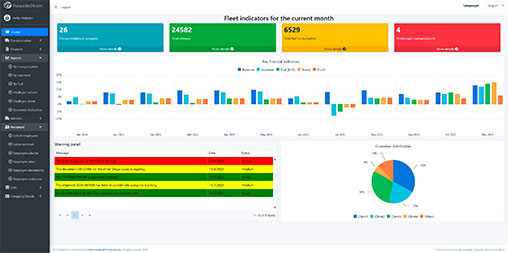
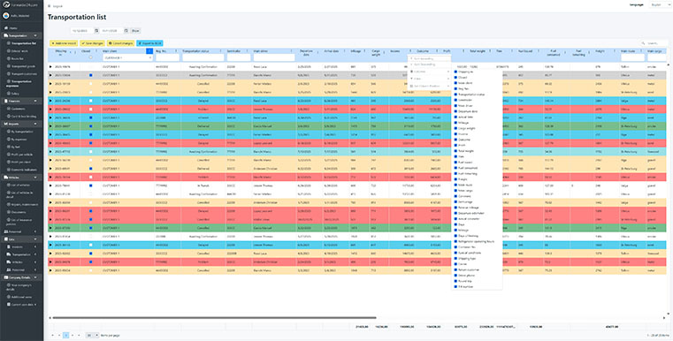
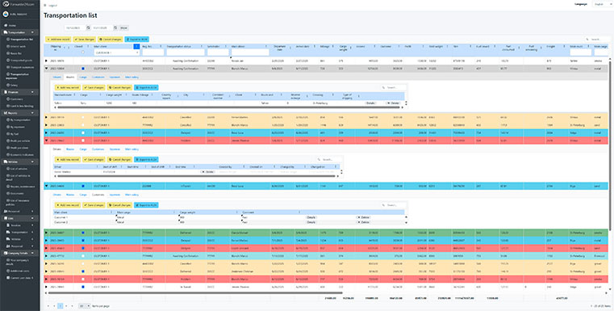
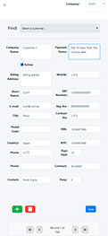

# Full Stack .NET Developer  
**Software Engineer | Architect | CTO | CEO**

[In English](#english) | [На русском](#russian) | [Eesti keeles](#estonian) | [📸 Screenshots](#screenshots)

---

## In English

Software developer with more than **30 years of experience** in designing and implementing business applications for commercial and public-sector organizations.

Specialized in **web-based solutions** for automation of logistics, accounting, manufacturing, sales, and warehouse operations — from internal ERP systems to cloud-based SaaS platforms.

Author of **20+ full-featured software products** as **CEO and CTO**, including:  
- a suite of desktop industry solutions — **CargoPro**, **ERP**, and **WMS**;  
- commercial products **EhitusEelarve** (500+ sales) and **Sõidulehed** (500+ sales).  

These solutions have been successfully used by **1,500+ companies** in Estonia and abroad — many still operating today.

For the past **10 years**, actively working with **.NET** and modern **web architectures**.  
Founder and developer of the SaaS platform [forwarder24.com](https://forwarder24.com).  
Designing and building **B2B systems** tailored to specific business needs, acting as **CTO and lead engineer**.  
I have experience in developing and managing projects covering multiple countries and language groups across different continents.

---

### Core Competencies

✔️ **Software Solution Architecture:**  
Design, development, and modernization of complex enterprise systems — both proprietary and third-party solutions — from legacy systems of the 1990s–2000s to modern cloud and microservices architectures

✔️ **Full Stack .NET Development:**  
`.NET / ASP.NET Core (from legacy to latest .NET 9)`, `C#`, `Razor`, `Entity Framework`, `REST API`, `SignalR`

✔️ **Frontend & UI:**  
Telerik UI (Razor, Kendo UI), React, TypeScript, JavaScript, Angular (mid),  jQuery

✔️ **Databases:**  
`MS SQL Server`, `PostgreSQL`, `MySQL`

✔️ **Integrations:**  
`API`, `JSON/XML`, `Web Services`, `1C`, `GPS`, accounting systems, product suppliers, telematics services

✔️ **DevOps & Infrastructure:**  
Azure (cloud services, virtual machines, PaaS, SaaS), `Docker`, `Windows Server`, `Hyper-V`, архитектура микросервисов, own hosting [pilv24.ee](https://pilv24.ee)

✔️ **CMS & e-commerce:**  
`nopCommerce`, `Orchard Core`, `Piranha CMS`

---

I started working with **legacy technologies** that were widely used in the **1990s and 2000s**, and I have **deep hands-on experience in developing and maintaining complex solutions** based on **MS Access + MS SQL Server**, including multi-layer **business logic**, **reporting**, and **integrations**.

Currently, I perform **only data and functionality migration to modern architectures** from technologies and formats such as `MDB`, `FoxPro`, `Visual FoxPro`, `DBF / dBase`, `Paradox`, `Clipper`, `Btrieve`, `CSV / TXT`,  **legacy file-based databases**, and **custom formats**,  while **preserving business logic and data integrity**.

---

Actively applying **AI technologies** in software design and development —  from **data analysis** and **business process automation** to **AI-assisted coding** and **development optimization**.

Has many years of partnership experience with **Microsoft** on *Dynamics*; currently collaborates with **Telerik (Progress)** on product development and holds an active license.

Participated in **publicly funded projects** (PRIA, ERAA, EAS). Developed software for the **Logistics Department of Tallinn University of Technology (TalTech)** and other state-level organizations.

---

 **Open for collaboration, consulting, and exciting new projects.**

---

### Additional Information

- I specialize in websites as information systems — where functionality and data handling matter more than mere presentation;  
- Available to work as a **legal entity**;  
- **Discounts available** for large-scale projects.

---

🔝 [Back to top](#top) | [На русском](#russian) | [Eesti keeles](#estonian) | [📸 Project Screenshots](#screenshots)

---

## На русском

Разработчик программного обеспечения с **более чем 30-летним опытом** проектирования и реализации бизнес-приложений для коммерческих и государственных организаций.

Специализируюсь на **WEB-решениях для автоматизации логистики, учёта, производства, продаж и складских процессов** — от внутренних ERP-решений до облачных SaaS-платформ.

Автор **более 20 полноценных программных продуктов** в роли **CEO и CTO**, включая:  
- группу десктопных отраслевых решений **CargoPro**, **ERP** и **WMS**;  
- тиражные продукты **EhitusEelarve** (более 500 продаж) и **Sõidulehed** (более 500 продаж).  

Эти решения за последние десятилетия использовались **более чем 1500 предприятиями** в Эстонии и за её пределами — многие из них применяются по сей день.

Последние **10 лет** активно работаю с **.NET** и современными **web-архитектурами**.  
Развиваю собственный SaaS-сервис [forwarder24.com](https://forwarder24.com) и создаю **B2B-системы** под индивидуальные требования бизнеса в роли **CTO и ведущего исполнителя проектов**.  
У меня есть опыт разработки и управления проектами, охватывающими несколько стран и языковых групп на разных континентах.

---

### Основные компетенции

✔️ **Архитектура программных решений:**  
Проектирование, развитие и модернизация комплексных корпоративных систем — как собственной разработки, так и сторонних решений — от legacy-систем 1990–2000-х годов до современных cloud- и microservices-архитектур

✔️ **Full Stack .NET разработка:**  
`.NET / ASP.NET Core (от устаревших версий до последней .NET 9)`, `C#`, `Razor`, `Entity Framework`, `REST API`, `SignalR`

✔️ **Frontend и UI:**  
Telerik UI (Razor, Kendo UI), React, TypeScript, JavaScript, Angular (mid),  jQuery

✔️ **Базы данных:**  
`MS SQL Server`, `PostgreSQL`, `MySQL`

✔️ **Интеграции:**  
`API`, `JSON/XML`, `Web Services`, `1С`, `GPS`, бухгалтерские системы, поставщики товаров, сервисы телематики

✔️ **DevOps и инфраструктура:**  
Azure (cloud services, virtual machines, PaaS, SaaS), `Docker`, `Windows Server`, `Hyper-V`, microservices architectures, собственный хостинг [pilv24.ee](https://pilv24.ee)

✔️ **CMS и e-commerce:**  
`nopCommerce`, `Orchard Core`, `Piranha CMS`

Начинал работу с технологиями предыдущих поколений, широко применявшимися в **1990-е и 2000-е годы**,  и имею **глубокий практический опыт разработки и сопровождения сложных решений** на **MS Access + MS SQL Server** с многоуровневой **бизнес-логикой**, **отчётностью** и **интеграциями**.

Сейчас выполняю **только перенос данных и функционала в современные архитектуры** из технологий и форматов, таких как `MDB`, `FoxPro`, `Visual FoxPro`, `DBF / dBase`, `Paradox`, `Clipper`, `Btrieve`, `CSV / TXT`, **старые файловые базы данных** и **кастомные форматы**, с **сохранением бизнес-логики и целостности данных**.

---

Активно применяю **AI** при проектировании и разработке решений — от анализа данных и автоматизации бизнес-процессов до **AI-assisted coding** и оптимизации разработки.

Есть многолетний опыт партнёрства с **Microsoft** по *Dynamics*, в настоящее время сотрудничаю с **Telerik (Progress)** по развитию продукта и имею их лицензию.

Участвовал в реализации **проектов с государственным финансированием** (PRIA, ERAA, EAS). Разрабатывал ПО для **кафедры логистики Таллиннского технического университета (TalTech, ранее ТТУ)** и других предприятий государственного значения.

---

**Открыт к сотрудничеству, консультациям и новым интересным проектам.**

---

### Дополнительно

- Специализируюсь на сайтах как инфосистемах — там, где важна функциональность и работа с данными, а не только презентация;  
- Возможна работа как **физическое**, так и **юридическое лицо**;  
- Предусмотрены **скидки при значительном объёме работ**.

---

🔝 [Наверх](#top) | [In English](#english) | [Eesti keeles](#estonian) | [📸 Скриншоты проектов](#screenshots)

---

## Eesti keeles

**Üle 30-aastase kogemusega** tarkvaraarendaja äritarkvara projekteerimisel ja arendamisel nii era- kui ka avaliku sektori organisatsioonidele.

Spetsialiseerunud **veebipõhistele lahendustele** logistika, raamatupidamise, tootmise, müügi ja laoprotsesside automatiseerimiseks —  
alates sisemistest ERP-süsteemidest kuni pilvepõhiste SaaS-platvormideni.

**Üle 20 täieliku tarkvaratoote autor** tegevjuhina (CEO) ja tehnoloogiajuhina (CTO), sealhulgas:  
- tööstusspetsiifiliste töölauarakenduste sari **CargoPro**, **ERP** ja **WMS**;  
- kommertstooded **EhitusEelarve** (500+ müüki) ja **Sõidulehed** (500+ müüki).  

Need lahendused on viimaste aastakümnete jooksul olnud edukalt kasutusel **üle 1500 ettevõttes** Eestis ja välismaal — paljud neist töötavad tänaseni.

Viimased **10 aastat** olen aktiivselt töötanud **.NET** ja kaasaegsete **veebiarhitektuuride** alal.  
Arendan oma SaaS-platvormi [forwarder24.com](https://forwarder24.com) ning loon **B2B-süsteeme**, mis on kohandatud ettevõtete individuaalsetele vajadustele, tegutsedes **CTO ja juhtiva arendajana**.  
Mul on kogemus projektide arendamise ja juhtimisega, mis hõlmavad mitut riiki ja keelegruppi eri kontinentidel.

---

### Põhioskused

✔️ **Tarkvaralahenduste arhitektuur:**  
Keerukate ettevõttelahenduste projekteerimine, arendamine ja moderniseerimine — nii oma arenduste kui ka kolmandate osapoolte lahenduste puhul — alates 1990.–2000. aastate legacy-süsteemidest kuni tänapäevaste pilve- ja mikroteenuste arhitektuurideni

✔️ **Full Stack .NET arendus:**  
`.NET / ASP.NET Core (alates vanadest versioonidest kuni uusima .NET 9-ni)`, `C#`, `Razor`, `Entity Framework`, `REST API`, `SignalR`

✔️ **Frontend ja kasutajaliides:**  
Telerik UI (Razor, Kendo UI), React, TypeScript, JavaScript, Angular (mid),  jQuery

✔️ **Andmebaasid:**  
`MS SQL Server`, `PostgreSQL`, `MySQL`

✔️ **Integratsioonid:**  
`API`, `JSON/XML`, `Web Services`, `1C`, `GPS`, raamatupidamissüsteemid, tarnijate ja telemaatika teenused

✔️ **DevOps ja infrastruktuur:**  
Azure (cloud services, virtual machines, PaaS, SaaS), `Docker`, `Windows Server`, `Hyper-V`, mikroteenuste arhitektuur, oma majutus [pilv24.ee](https://pilv24.ee)

✔️ **CMS ja e-kaubandus:**  
`nopCommerce`, `Orchard Core`, `Piranha CMS`

Alustasin tööd **varasemate põlvkondade tehnoloogiatega**, mida kasutati laialdaselt **1990. ja 2000. aastatel**, ning mul on **sügav praktiline kogemus keerukate lahenduste arendamisel ja hooldamisel**, kasutades **MS Access + MS SQL Server**-it, koos mitmetasandilise **äriloogika**, **aruandluse** ja **integratsioonidega**.

Praegu tegelen **ainult andmete ja funktsionaalsuse üleviimisega kaasaegsetesse arhitektuuridesse** tehnoloogiatest ja vormingutest nagu `MDB`, `FoxPro`, `Visual FoxPro`, `DBF / dBase`, `Paradox`, `Clipper`, `Btrieve`, `CSV / TXT`, **vanad failipõhised andmebaasid** ja **kohandatud vormingud**, säilitades **äriloogika ja andmete tervikluse**.

---

Kasutab aktiivselt **tehisintellekti (AI)** tarkvaralahenduste projekteerimisel ja arendamisel — alates **andmeanalüüsist** ja **äriprotsesside automatiseerimisest** kuni **AI-toega koodikirjutamise** ja **arenduse optimeerimiseni**.

On pikaajaline kogemus **partnerlusest Microsoftiga** *(Dynamics)*, ning praegu teen koostööd **Telerikuga (Progress)** toodete arendamisel ja omab kehtivat litsentsi.

Osalenud **riiklikult rahastatud projektides** (PRIA, ERAA, EAS). Arendanud tarkvara **TalTechi logistikainstituudile** (endine TTÜ) ja teistele riikliku tähtsusega organisatsioonidele.

---

📬 **Avatud koostööle, konsultatsioonidele ja uutele huvitavatele projektidele.**

---

### Täiendav teave

- Olen spetsialiseerunud veebisaitidele kui infosüsteemidele — seal, kus tähtis on funktsionaalsus ja andmetega töötamine, mitte ainult esitus;  
- Töötan nii **füüsilise isiku** kui ka **juriidilise isikuna**;  
- **Mahukamate projektide puhul on ette nähtud soodustused.**

---

🔝 [Tagasi algusesse](#top) | [In English](#english) | [На русском](#russian) | [📸 Projekti ekraanipildid](#screenshots)

---

## 📸 Project Screenshots

    
  

    
  

  

    
  

    
  

---
🔝 [Back to top](#top) | [In English](#english) | [На русском](#russian) | [Eesti keeles](#estonian)

